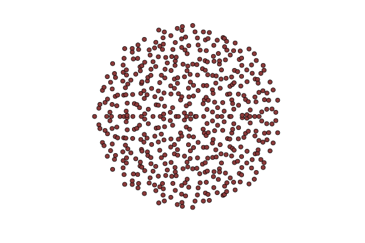
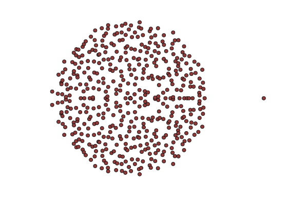

% The characteristic polynomial of sparse zero-one matrices 
% Simon Coste - INRIA
% Journées MAS 2021

# Eigenvalues of non-Hermitian matrices
~~~
> using LinearAlgebra
> eigvals(randn(500,500))
~~~

# Example: random regular digraph 
~~~
> using LinearAlgebra, Erdos
> eigvals(random_regular_digraph(500, 3))
~~~

# My favourite example: Bernoulli, sparse 
~~~
> using LinearAlgebra
> eigvals(rand(500,500).<0.01)
~~~

$A_n$ = an $n \times n$ matrix whose entries are iid $\mathrm{Bernoulli}(d/n)$ entries.

# Reverse characteristic polynomial

$$q_n (z) = \det(I_n - zA_n)$$

The coefficients of $q_n(z)=1+\Delta_1z+\Delta_2z^2+...+\Delta_{n}z^{n}$ are
$$\Delta_k = (-1)^k \frac{P_k(\mathrm{trace}(A_n^1), ..., \mathrm{trace}(A_n^k))}{k!},$$

where the $P_k$ are polynomials.

# The simplest method: traces + tightness 

# The limits of the traces of $A^k_n$

::: {.theorem} 

For every $k$, 
$$(\mathrm{tr}(A_n^1), ..., \mathrm{tr}(A_n^k)) \xrightarrow[n \to \infty]{\mathrm{law}} (X_1, ... , X_k).$$
where 
$$X_k := \sum_{\ell|k} \ell Y_\ell$$
$(Y_\ell : \ell \in \mathbb{N}^*)$ = family of independent r.v., $Y_\ell \sim \mathrm{Poi}(d^\ell / \ell)$. 
:::

# The limits of the coefficients of $q_n$

$$\Delta_k \to a_k =  (-1)^k \frac{P_k(X_1, ... , X_k)}{k!}$$
Let $F$ be the log-generating function of these random variables:
$$F(z) = 1 + \sum_{k=1}^\infty a_k z^k $$

:::{.theorem}
Coefficients of $q_n$ $\to$ Coefficients of $F$
:::

Do we have stronger convergence than that?

# Weak convergence of analytic functions

::: {.theorem}

[Shirai 2012](https://repository.kulib.kyoto-u.ac.jp/dspace/bitstream/2433/198072/1/B34_020.pdf)

If $f_n$ is a sequence of **random** analytic functions in an open set $D$ and if

1) The coeffs of $f_n$ converge towards $(a_k)$ 

2) **$f_n$ is tight in $D$**

Then $f_n \to f$ where $f(z) = \sum a_k z^k$.

:::

# Tightness in holomorphic spaces

Let $f_n$ be a sequence of random analytic functions:
$$f_n(z) = \sum_{k=0}^\infty a_{n,k}z^k.$$

::: {.theorem}

If there is a $c$ such that
$$ \sup_n \mathbf{E}[|a_{n,k}|^2] \leqslant c r^k $$
then $(f_n)$ is tight on $D(0,\sqrt{r})$. 

:::

# Tightness of $(q_n)$

::: {.theorem}
The sequence $q_n$ is tight in $D(0,\sqrt{1/d})$. 
:::

::: {.proof}
**Proof**. We must bound the 2-norm of the coefficients of $q_n$, the $\Delta_k$. 

We use $\Delta_k = \sum_{I \subset [n], |I|=k}\det(A(I))$ then develop $|\Delta_k|^2$. 

We get a double sum of $\mathbf{E}[\det(A(I))\det(A(J))]$ with $I,J$ subsets of $[n]$. 

The value of each summand depends on the size of $I\cap J$.  

$$\mathbf{E}[|\Delta_k|^2] = (n)_k (d/n)^k (1-d/n)^{k-1}(1 - kd/n -p + kd - k^2d/n) =O(d^k)$$

:::

#

:::{.theorem}
$q_n \to F$ as holomorphic functions on $D(0,d^{-1/2})$.
:::

# Extras on $F$

$$F(z) = \exp \left( -\sum_{k=1}^\infty X_k \frac{z^k}{k} \right) = \prod_{k=1}^\infty (1 - z^k)^{Y_k}$$

- The radius of convergence **inside the exp** is $1/d$. 

- The radius of convergence of $F$ is $1/\sqrt{d}$ and $F$ has one zero at $1/d$.

- $F$ has no other zeroes inside $D(0,1/\sqrt{d})$. 

# Zeroes of $q_n$ => zeroes of $F$

:::{.theorem}
The zeroes are continuous wrt weak convergence on $\mathbb{H}$. 
:::

Zeroes of $q_n$ inside $D(0,1/\sqrt{d})$ = inverse of eigenvalues of $A_n$ outside $D(0,\sqrt{d})$.

Asymptotically, $A_n$ has one eigenvalue close to $d$.

The other ones are smaller than $\sqrt{d}$. 

# Friedman theorems everywhere

Can you have a short proof of Friedman's $2\sqrt{d-1}$-theorem?

1. Prove that the non-backtracking traces converge towards something [Dumitriu et al 2012]

2. Prove that $q_n$ is tight...

# 

Bonne rentrée à tous !

